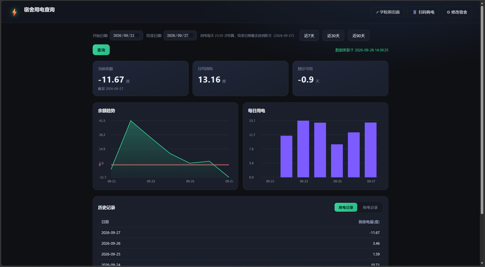

# 深大宿舍电费查询面板

**给深圳大学同学用的**宿舍用电查询工具：不用再每次登录学校那套「智能集中式电能计量系统」、
不用翻它的网页表格，打开就能看到——

**当前余额 · 余额趋势图 · 每天用了多少电 · 用电/购电记录**，余额快用完还能自动推一条微信提醒。

> 学校系统每天只在 **23:59** 结算一次，所以「今天的用电」在当天是查不到的（这不是 bug，见文末 FAQ）。
> 服务端的脾气我整理在 [`docs/逆向笔记.md`](docs/逆向笔记.md)（想改代码再看）。



## 两种用法，挑一个

### 用法 A：下载 exe 直接双击（最省事，不碰 Python）

1. 打开本仓库右侧的 **[Releases](../../releases)**，下载最新的 **`szu-electricity.exe`**
   （约 37 MB；附件上标着「宿舍电费查询 · Windows 免安装版」）
2. 把它放进一个自己的文件夹（例如 `D:\电费查询\`），**双击**
3. 浏览器会自动打开面板；第一次会让你选校区、楼栋、填房间号（见下面的「配置宿舍」）
4. 想以后好找：把 exe 拖到桌面，或右键 → 发送到 → 桌面快捷方式

> exe 文件名是英文（`szu-electricity.exe`），因为 **GitHub 的 Release 附件名不支持中文** —— 
> 用 API/命令行上传时中文名会被静默改写成 `default.exe`（label 倒是能用中文）。
> 下载到本地后你随便改名，不影响运行。

> 这个 exe **自带 Python 运行时**，电脑上不用装 Python、不用装任何东西。
> `config.json` 和 `data\` 会生成在 **exe 所在的文件夹**里（你的配置和缓存，删掉就恢复初始状态）。
>
> ⚠️ 第一次运行 Windows 可能弹「Windows 已保护你的电脑」（SmartScreen）—— 因为 exe **没有买代码签名证书**，
> 这是所有个人开源软件的通病。点 **「更多信息」→「仍要运行」** 即可。介意的话用下面的用法 B 跑源码。
> 个别杀毒软件也可能误报，同样是"未签名 exe"导致的，加白名单即可。

### 用法 B：跑源码（要装 Python，但能自己改代码）

#### 第 0 步：Python（脚本会替你搞定）

**什么都不用装**。双击 `start.bat` 后它会自己找 Python：PATH 里的、py 启动器、常见安装目录
（`%LOCALAPPDATA%\Programs\Python` 等）都会扫一遍。**真的一个都没找到时**，它会问你一句
「Install Python now? [Y/N]」，按 `Y` 就用**华为云镜像**下载官方安装包并静默安装
（约 25 MB，只装给当前用户，**不需要管理员权限**）；按 `N` 就给你官网地址自己装。
装了以后不会再问——它认得已有的 Python。

#### 第 1 步：连上校园网，启动

把项目文件夹弄到电脑上（本页右上角绿色 **`Code` → `Download ZIP`**，解压后进那个文件夹），
然后**双击 `start.bat`**。

它会：自动装好依赖 → 启动服务 → 打开浏览器（`http://127.0.0.1:8788`）。
**第一次运行还会在桌面创建「宿舍电费查询」快捷方式**，以后双击桌面那个就行（已存在则跳过，不会重复创建）。

> 不是 Windows、或者想用命令行：`pip install -r requirements.txt` 然后 `python app.py`。
> 端口可用环境变量改：`set PORT=9000 && python app.py`。

## 配置宿舍（两种用法都一样）

第一次打开会自动弹出「设置宿舍」，照着数字点：

| 步骤 | 你要做的 | 说明 |
|---|---|---|
| **① 连上学校的系统** | 点 **「🔍 自动检测」** | 电脑要先连校园网（WiFi 或网线）。检测成功会提示「已连上 …」。换校区时点它也会自动刷新 |
| **② 选校区** | 从下拉里选 | 北校区 / 南校区 / 西丽校区 / 深大新斋区 —— **每个校区的楼栋表不一样**，所以先选校区 |
| **③ 选楼栋 + 填房间号** | 选楼栋、填门牌号 | 房间号就是你宿舍门上的号（例如 `301`）。被按层拆开的楼栋（如「3-6 层 / 7-10 层」）要选准自己住的那一段 |

点 **「保存并查询」**，面板上就有数据了。

> 之后想换宿舍、换校区：点右上角 **「⚙ 修改宿舍」** 重来一遍三步即可。

### 可选：余额提醒（企业微信）

1. 企业微信里建一个群 → 群设置 → 添加群机器人 → 复制 Webhook 里的 key
2. 在项目文件夹里新建一个文件 `.env`，内容：
   ```ini
   SIMS_WEBHOOK_KEY=粘贴你的key
   SIMS_ALERT_THRESHOLD=20
   ```
   `SIMS_ALERT_THRESHOLD` 是告警阈值（度），低于它就提醒，默认 20。
3. 让它每天自动跑一次（在项目文件夹里右键「在终端中打开」）：
   ```
   schtasks /create /tn 电费提醒 /tr "python reminder.py" /sc daily /st 09:00
   ```
   同一天只提醒一次；余额充足时它什么都不发。

## 都有什么功能

- **四张卡片**：当前余额（下面标着「截至 某天」——余额是每天结算出来的，不是实时读数）、
  日均用电、预计可用天数、今日用电（真有当天数据才出现）
- **趋势图 + 柱状图**：鼠标滑上去能看到那天的具体数字
- **两个记录表**：用电记录、购电记录（自动把没用的列藏起来）
- **日期区间**：结束日期会上限——用电最多选到**昨天**（今天还没结算），购电可以选到**今天**
- **顶栏两条捷径**：
  - 「↗ 学校原页面」—— 一击直达**你自己那间宿舍**的学校原页面，不用重新登录、不用再选楼栋房号
  - 「📱 扫码购电」—— 缴费页只能在微信里打开，所以给二维码（在「高级设置」里填缴费页网址才会出现）
- **本地缓存**：页面秒开上次的数据，点「查询」才真去学校抓
- 零依赖前端：没有 CDN、没有 npm，校园内网也能跑

## 常见问题

| 现象 | 怎么办 |
|---|---|
| 点「自动检测」说连不上 | **电脑没连校园网**。连上校园网 WiFi 或插网线再点一次；宿舍内网也要能访问电费服务器 |
| 「自动检测」成功但楼栋列表里没有我那栋 | 先确认**校区选对了**（楼栋表是按校区分的），改校区后要再点一次「自动检测」刷新 |
| 提示「楼栋里没有房间 XXX」 | 房号跟楼栋对不上。被按层拆开的楼栋房号不通用（「3-6 层」的 301 和「7-10 层」的 301 是两间房），选准自己那一段 |
| 查不到今天的用电 | **正常**。学校每天 23:59 才结算，当天数据在当天不存在 |
| 「今日用电」卡片不见了 | 同上：真有数据才显示，没有就整张消失，不用昨天的数糊弄 |
| 为什么没有「账户余电」列 | 它要等当天结算才算得出来，当天购电行永远算不出，所以整列不做 |
| 端口被占用 / 打不开页面 | 关掉旧的命令行窗口再双击 `start.bat`；或改端口：`set PORT=9000 && python app.py` |
| 点「自动检测」报 `请求失败（HTTP 404）`，或页面顶部出现红条 | **后台程序是旧版本**：页面（静态文件）每次刷新都是新的，但 Python 进程不重启就一直跑旧代码，所以新接口不存在。**关掉那个跑着服务的命令行窗口**，再双击 `start.bat`。程序会自己检测版本并在页面顶部提示这一点 |
| 装依赖很慢或失败 | 校园网直连 pypi.org 常不通，换镜像：`pip install -r requirements.txt -i https://mirrors.aliyun.com/pypi/simple/` |
| 双击 `start.bat` 弹一堆「不是内部或外部命令」 | 正常版本不会这样（脚本是**纯 ASCII**，cmd 在中文系统上按 GBK 读它）。只有你把脚本另存成带中文的 UTF-8 才会出现——重新下载一份即可 |
| 桌面出现「宿舍电费查询」快捷方式 | 这是**首次运行**自动建的（找不到才建，已存在会跳过）。不想要就删掉，不影响程序 |
| 没装 Python 会怎样 | 脚本会找一遍（PATH、py 启动器、常见安装目录），都没有就问你一句；按 `Y` 自动从华为云镜像下载官方安装包装上（仅当前用户、不需要管理员），按 `N` 给你官网地址 |
| 想给别的学校用 | 改 `scraper.py` 的楼栋表 + `app.py` 里的 `DEFAULT_SERVERS`，页面「高级设置」也能手填服务器地址 |
| 双击 exe 弹「Windows 已保护你的电脑」 | exe 没买代码签名证书（个人开源项目的通病）。点「更多信息」→「仍要运行」；杀软误报同理，加白名单 |
| exe 双击后一闪而过 | 换到**一个普通文件夹**再试（别放在压缩包预览里、别放网络盘）。程序会自己开一个黑色命令行窗口，**那个窗口就是服务本体，关掉它就停了** |
| 想换 server / 校区 | 两种方式都一样：页面右上角「⚙ 修改宿舍」→「自动检测」重来一遍 |

## 技术栈与目录

后端 Flask，抓取用 requests + BeautifulSoup4，前端原生 HTML/CSS/JS（Canvas 手绘图表，零第三方库）。

```
app.py                Flask 服务：静态页 + JSON API + /school 中转页 + 二维码渲染 + /api/detect 自检
paths.py              目录约定：打包后 static/ 走解包目录，config.json / data 落在 exe 旁边
scraper.py            抓取层：登录、查询、翻页、解析 gb2312 表格、校区/楼栋表
store.py              本地缓存（按「宿舍 + 日期区间 + 类型」分 key）
reminder.py           余额告警，单次执行，交给计划任务
static/               index.html / app.js / style.css / favicon.ico
tools/make_icon.py    用 Pillow 生成 favicon.ico（exe 图标与网页标签页图标共用）
docs/逆向笔记.md        服务端行为与踩坑记录（改代码前先看）
config.example.json   配置示例（真正的 config.json 不进仓库，含宿舍信息）
dist/                 打包产物（exe），不进仓库
```

### 自己打包 exe

```bash
pip install -r requirements.txt pyinstaller
python tools/make_icon.py                      # 生成图标（改配色/形状就改这个脚本）
pyinstaller --noconfirm --onefile --console \
  --name szu-dorm-electricity --icon static/favicon.ico \
  --add-data "static;static" app.py             # 产物在 dist/
```

打出来的单文件自带 Python 运行时（约 37 MB），扔到没装 Python 的电脑上双击就能跑。
Windows 上 `--add-data` 的源/目标用 `;` 分隔；若 `--specpath` 指向别处，
源路径要写**绝对路径**（相对路径按 spec 文件所在目录解析，否则报 `Unable to find 'static'`）。

> 用命令行/API 往 Release 传附件时，**附件名必须是 ASCII**：中文名会被 GitHub 静默改成
> `default.exe`（`label` 字段倒是支持中文）。web 网页拖拽上传没这个限制。

## API

| 接口 | 说明 |
|---|---|
| `GET /api/detect?client=` | 探测学校服务器，返回校区列表 + 该校区的楼栋列表（「自动检测」用的就是它） |
| `GET /school` | 中转页：拼好登录表单自动 POST，一击进自己宿舍的学校原页面 |
| `GET /api/config` / `PUT /api/config` | 读/改配置（保存前校验，非法返回 400 + 原因） |
| `GET /api/dorm-options` | 楼栋 + 校区下拉选项 |
| `GET /api/cached?begin=&end=&kind=trend` | 只读本地缓存 |
| `GET /api/records?begin=&end=&type=2` | 原始记录（`type=1` 购电） |
| `GET /api/trend?begin=&end=&force=1` | 趋势与统计（不传 `end` 默认取昨天） |
| `GET /api/purchase?begin=&end=` | 购电记录 |
| `GET /api/qrcode.svg?url=` | 把链接渲染成二维码 SVG |

## 隐私与安全

- **数据只在你自己的电脑上**（`config.json` + `data/cache.json`）。对外只发两种请求：
  学校电费服务器、以及你自己配的企业微信机器人。
- `config.json`（宿舍楼栋/房间号）、`.env`（机器人 key）、`data/`（真实流水）
  **都在 `.gitignore` 里，不会进仓库**。
- 本工具**不采集购电人信息**：接口里的「购买者」实际是充值流水号，不带姓名/学号/一卡通号，
  本工具也不记录、不展示。
- 数据本来就是学校系统产出的，这个工具只是换个好看的壳把它读出来。

## 免责声明

仅供查询**自己宿舍**的用电信息，请遵守学校网络与信息系统使用规定。使用风险自负。

## License

MIT © 2026 gordon
